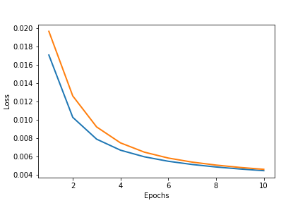
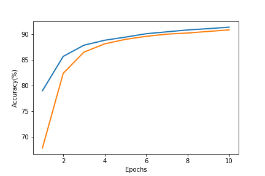

# Transfer training of AlexNet on Tiny ImageNet in PyTorch

## Overview of the code

The code was written for homework 6 of [ME 595 Deep Learning cource](https://e-lab.github.io/html/teaching.html) offered at Purdue. In this project, [AlexNet](https://papers.nips.cc/paper/4824-imagenet-classification-with-deep-convolutional-neural-networks.pdf) is modified and used for classifying images in [Tiny ImageNet](https://tiny-imagenet.herokuapp.com/)
dataset. The structure and weights of convolution layers are kept exactly
the same as the pretrained AlexNet in PyTorch, while the fully connected layers are modified. Only the weights in fully connected layers are optimized during trying process. The Stochastic Gradient Descent is used with a learning rate of 0.01. The learning rate
also decays 5 % after every epoch during the training process.

In the first step of training, the images in the dataset are preprocessed. Only RGB images
are extracted from the dataset and pixel data are normalized. The whole dataset is used as the
input for training the neural network for ten epochs. The neural network receives a batch of 4
images every time and then performs the forward and backward propagations to get the gradient
with respect to the weights. The loss in the network is calculated using the Cross-Entropy
method. Every time the training data is passed through the neural network, I also tested on the
evaluation dataset and calculated the runtime loss and accuracy. 16 cpu processors are used to
train the neural network and it takes about 61 minutes to process 10 epochs of data.

## Results

```
Fig. 1. (a) Loss and (b) accuracy during the training and evaluation process. The evaluation
process has a smaller loss and higher accuracy than the training process. It takes 344 s for training each Epoch.
```
After 10 epochs, the neural network reaches an accuracy of 5.3% for training dataset, and 1 4 .0% for evaluation dataset. One reason for the low accuracy is that Tiny ImageNet dataset has a smaller image size (64x64) than input images used
by AlexNet (224x224). The images have been cropped many times when performing
convolution and maxPool operations, resulting a great loss of information in the input data. 

The loss and accuracy for the training and test dataset are shown in Fig. 1. The evaluation
process yields a smaller loss and higher accuracy than training process. This is probably because
the convolution layers in AlexNet works better for the evaluation dataset than the training dataset. 


